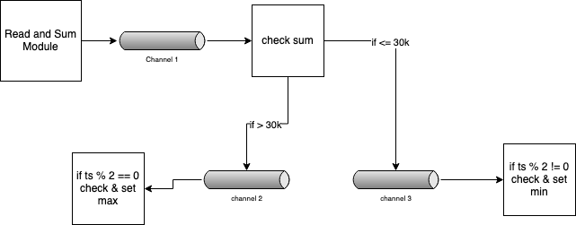

### `Challenge`

## Part 1

Read the input from the file, each message is seperated by an empty line. Read
the lines until you reach an empty line publish the sum to the channel `sum`.
Repeat this until you reach the end of the file.

## Part 2

Subscribe to the channel `sum` and if sum is greate than 30k, publish the sum to
channel `high_sum`.

If sum is less than 30k, publish the sum to channel `low_sum`.

## Part 3

Subscribe to the channel `high_sum`, if current unix timestamp even and current
sum is greater than previous one set redis key `max_sum` to the current sum.

## Part 4

Subscribe to the channel `low_sum`, if current unix timestamp odd and current
sum is lower than previous one set redis key `min_sum` to the current sum.

---

